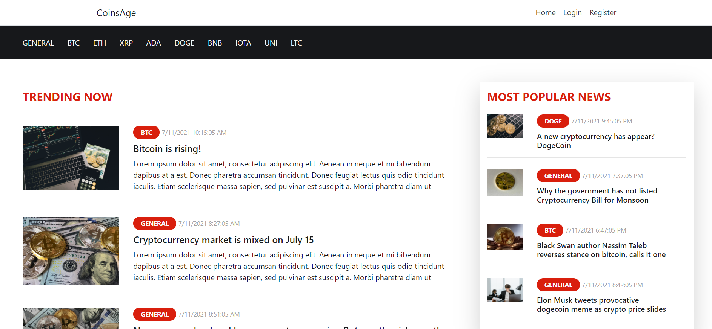
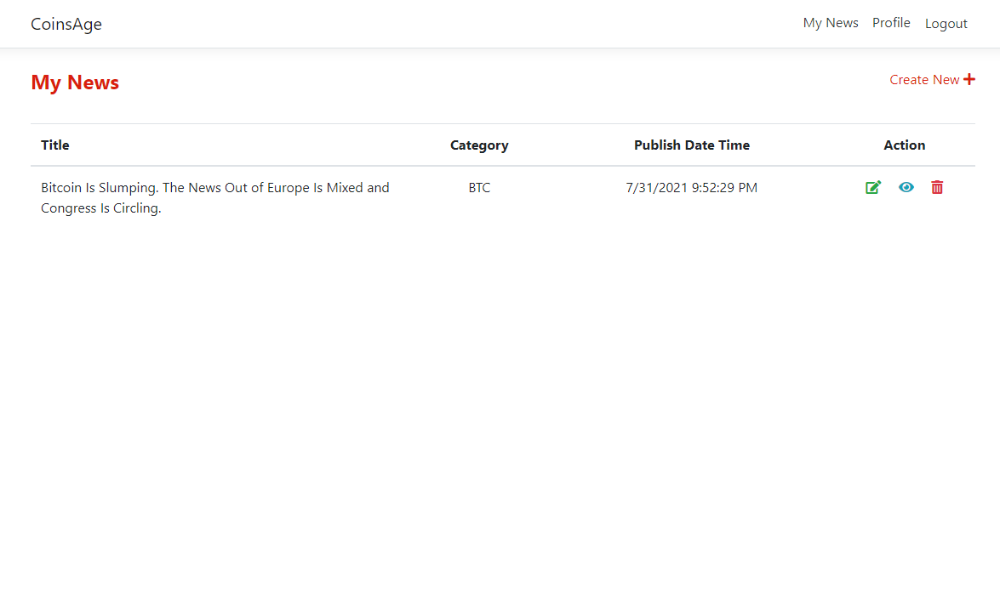

# CoinsAge
CoinsAge is a news media about the latest cryptocurrency news which is developed in web application that is being hosted on Microsoft Azure cloud.   

### List of features:
***As Guest (Main User):***
- View news
 

***As Writer (Secondary User):***
- Register
- Login and Logout
- Edit Profile
- Create and Delete News
- Create and Delete Category
 

***As Admin (Secondary User):***
- View all authors
- Remove authors
- View Dashboard
- Configurable popular or trending news
- Check login and logout history   

## Technologies Used  
- C#
- JavaScript
- HTML
- CSS
- Microsoft Azure
- Microsoft SQL Server Management Studio 18

## Screenshots  
- **Screenshot of Login page**  
 
- **Screenshot of Trending and Popular News**  
 
- **Screenshot of Author page**  
 
- **Screenshot of Add News page**  
 
- **Screenshot of Create User page**  
 
- **Screenshot of Category**  
 
